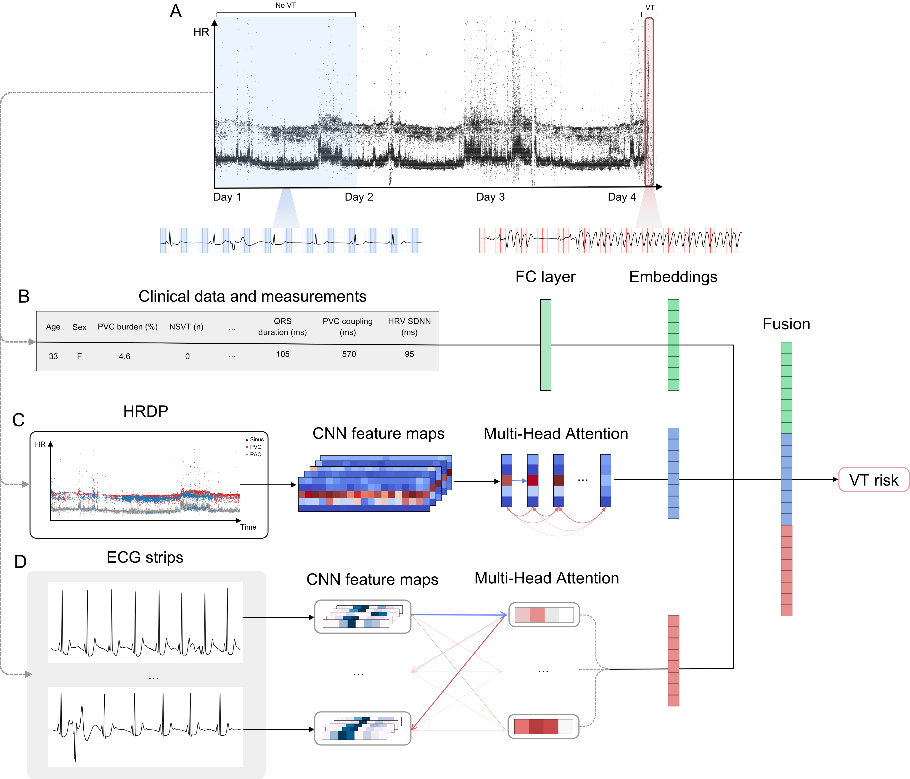

This repository includes the source code for the paper "Near-Term Prediction of Life-Threatening Ventricular Arrhythmias – Data from Ambulatory ECG Using Deep Learning" by Fiorina et al. (2023)



## Environment setup

Setup and activate conda environment
```
conda create -n predict_vt python=3.8
conda activate predict_vt
```

Install dependencies
```
pip3 install -r requirements.txt
```

## Data Preparation

### HRDP

The heart rate density plot (HRDP) is a representation of the autonomic nervous system recorded during ambulatory ECG monitoring. An HRDP can be generated using the timestamps of each QRS onset and origin of each beat (sinus, atrial, or ventricular). If you cannot access or derive the origin of each beat - using only the timestamps of each onset is still sufficient.

To generate an HRDP from an example ECG recording run the following script:
```bash
python3 generate_hrdps.py --working_dir data/ --height 300 --resolution 1
```

Which will generate a directory with the following structure:
```bash
├── hrdp_300h_1r
│   ├── uuid_1
│   │   ├── hrdp_A.npz
│   │   ├── hrdp_N.npz
│   │   ├── hrdp_V.npz
│   │   ├── hrdp_all.npz
│   │   └── metadata.json
│   └── ...
```

* `hrdp_A` : sparse HR matrix of premature supraventricular complexes
* `hrdp_N` : sparse HR matrix of sinus beats
* `hrdp_V` : sparse HR matrix of premature ventricular complexes
* `hrdp_all` : sparse HR matrix of all beats (sinus and ectopic beats)


You can inspect, slice, zoom, resample, and visualize an HRDP using the [HRDP](https://github.com/carbonati/lancet-predict-vt/blob/main/hrdp.py#L106) class
```python
from src.hrdp import HRDP

hrdp = HRDP.from_disk(
    "data/hrdp_300h_1r/uuid_1",
    beat_types=["N", "V", "A"],
    resolution=36
)
hrdp.plot();
```


## Citation
